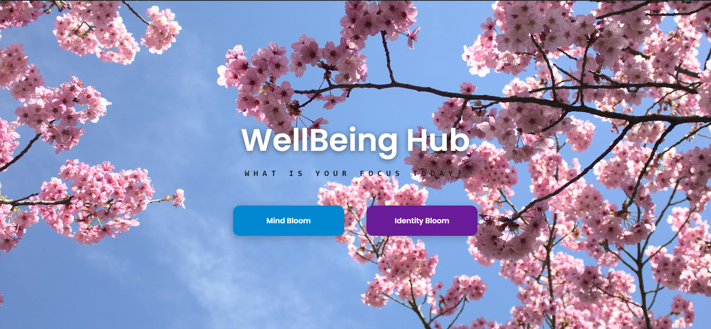
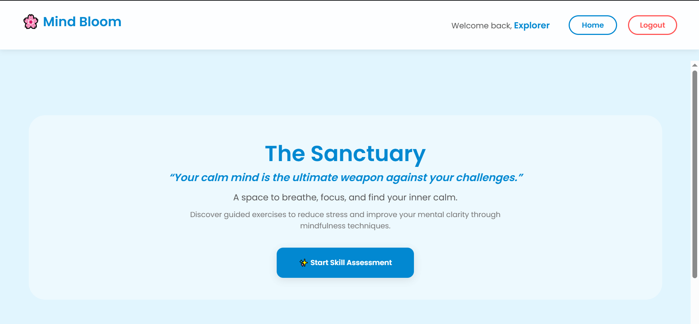
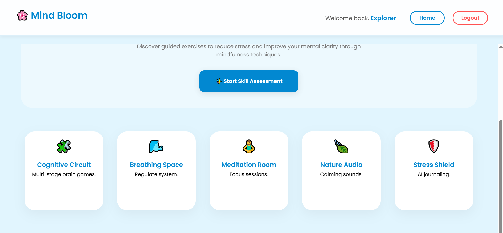
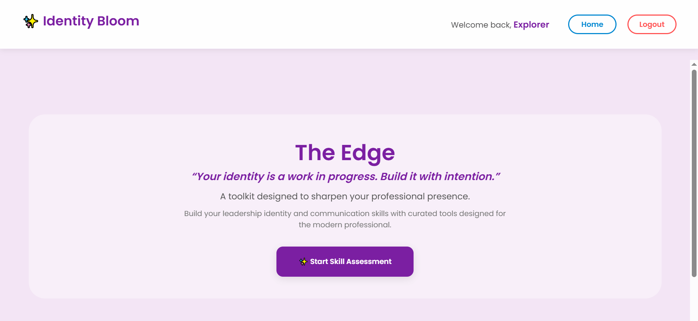
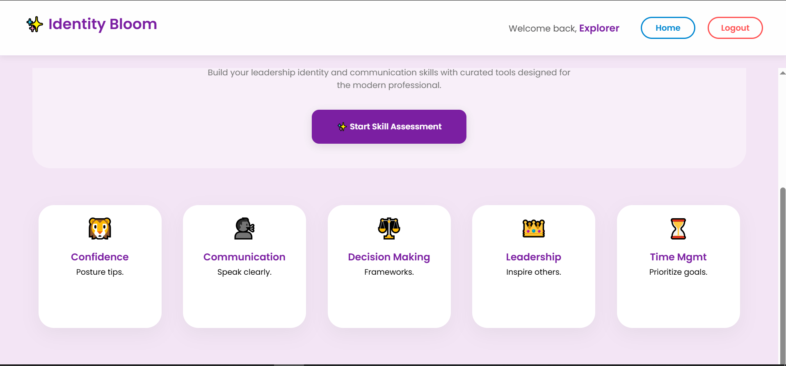

-- Wellbeing Hub 🌱 --

Wellbeing Hub is an AI-integrated wellness and personality development platform designed to facilitate early-stage personal growth. By combining mental health modules with professional identity building, the platform provides a holistic approach to self-improvement for the modern student and professional.

-- 🚀 Key Features --


🧠 Mind Bloom (Mental Wellness)

Cognitive Circuit: Focus training and mental sharpness exercises.

Breathing Space: Minimalist respiratory regulation for stress reduction.

Meditation Room: High-intensity mindfulness sessions with custom interval timers
.
Nature Audio: Environmental soundscapes (Summer Rain, Deep Forest) to anchor focus.

Stress Shield: AI-assisted journaling to filter negative thoughts.


🎭 Identity Bloom (Personality Growth)

Power Posture: Logic-based confidence training to lower cortisol and boost presence.

Communication: Tools for public speaking and active listening mastery.

Leadership: Decision-making and delegation training modules.

Time Management: Strategic systems to combat "time anxiety" and clutter.


📝 Smart Self-Assessment Engine

Inverted Scoring Logic: A diagnostic 25-question tool that identifies user weaknesses based on "struggle frequency."

Personalized Redirection: Analyzes real-time scores to suggest the most relevant training module.


-- 🛠️ Tech Stack --

## 🛠️ Tech Stack & Tools

| Component | Technology | Use Case |
| :--- | :--- | :--- |
| **Frontend** | React.js | UI Components & State Management |
| **Backend** | Node.js / Express | API Handling & Server Logic |
| **Database** | MongoDB | Storing Wellness Sessions |
| **Styling** | CSS3 / Lucide Icons | Responsive Design & Visual Feedback |
| **Logic** | JavaScript (ES6) | Inverted Scoring Assessment Engine |


-- 📂 Folder Structure --
```
wellbeing_hub/
├── frontend/
│   ├── src/
│   │   ├── components/
│   │   ├── data/
│   │   └── App.js
├── backend/
│   ├── models/
│   └── server.js
└── README.md
```


-- ⚙️ Installation & Setup --

Clone the repository

git clone https://github.com/Zoya220/Wellbeing_Hub.git

Setup Frontend

cd wellbeing-hub/frontend

npm install

npm start


Setup Backend

cd ../backend

npm install

node server.js


-- 📸 Screenshots --













-- 🎯 Future Roadmap --

AI Recommendations: Integrate Gemini API for personalized wellness tips.

Advanced Analytics: Data visualization for user progress tracking.

Mobile Integration: Responsive PWA support for on-the-go training.


-- 👤 Author --

ZOYA SHAIKH

RAHMAT SHAIKH

MUNNAZZAH KHAN

SANIA ANSARI


-- 🏛️ Academic & Technical Note --

This project is a primary submission for the Artificial Intelligence & Data Science (AIDS) Engineering curriculum. It explores the intersection of Behavioral Science and Full-Stack Engineering.